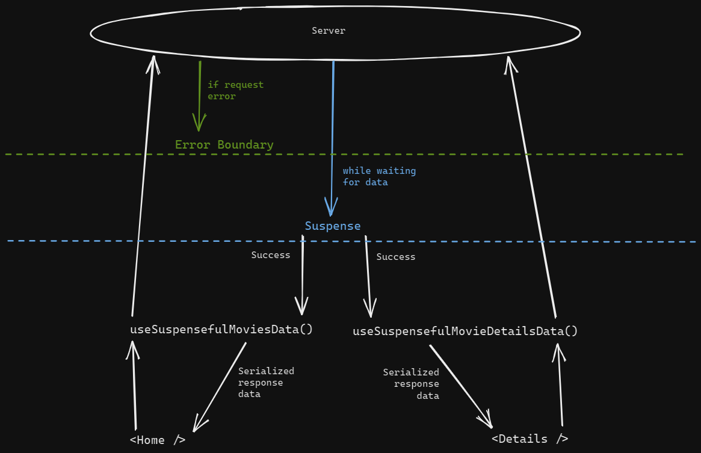

## MT ASSIGNMENT
 
### How to run
 
The project is using `yarn` to manage dependencies, so:
 
- run `yarn`
- then `yarn start`
 
Should start at port 8080.
 
### Architecture
 
#### Components Folder
 
All component folders, being `pages` and `components` share the same structure. To make file search easier, there's the named file, capitalized, with the name of the component, and an `index.js` file, exporting the contents of this file to make imports cleaner while keeping search results clean.
 
A component folder contains:
```
  Component.jsx - Component code
  index.js - Export default Component
  styles.scss - If styling is necessary
  constants.js - A place to share constants related to this module
  ChildComponent/ - Folder with child component that is used only in this component
```
 
Every component folder can have child component folders inside of it, just place it at the root of the component folder and you're set. The purpose of this is to set the usage scope for the given components. If a child component is going to be used somewhere else, the component should be moved to `src/components.
 
#### Hooks
 
The hooks are divided into two kinds of hooks: `suspenseful` and normal hooks. A `suspenseful` hook, it's a hook that depends on the usage of a `React.Suspense` up in the component tree to manage its loading state and an `ErrorBoundary` to manage its error states. This was made to leverage the loading/error states from components `(e.g: if(loading) return null)` to a place where it can be handled in batches, while also giving the flexibility to handle priority between loading states.
 
The separation between hooks is straightforward:
Suspenseful hooks should be kept inside the `hooks/suspenseful` folder, while normal hooks can be kept at the root of the `hooks` folder.

 
#### Data Fetching
 
All the data fetching is made using `react-query` and custom hooks. `react-query` is a great library for data fetching/mutating, taking care of most challenges that involve calling an async API. By default it de-dupes calls made with the same arguments, returning cached responses instead of re-calling the same API. It also has a very straightforward caching/cache invalidation API.
 
All the state related to API data is kept inside the data fetching hooks, providing a solid separation between the component state and the API state. The only way to access it is through hooks, and if possible, all the serialization should be done inside of the hooks as well.
 
#### Routing
 
I decided to choose `react-router`, because of the possibility and flexibility it gives us working with `nested layouts`. It also has route-based data fetching integrated into it with `loaders`, but I preferred to go with `react-query` instead.
 
#### State Management
 
The `react-query` library is in charge of managing server data, as it provides us with all the above-described benefits and even more if we dig through the library a little more. For component state, I choose `jotai` for global state `atoms`, as they are extremely composable, making it easy to create new actions with almost no boilerplate. <br />
The use case for `jotai` came from the need of having a global `wishlist` that could be accessed anywhere in the application. `jotai` also makes it easy to integrate with LocalStorage, through the get/set primitives, which gives you a perfect place to call LocalStorage and manipulate its state. <br>
Apart from `jotai` and `react-query` all the state is managed through component state.
 
